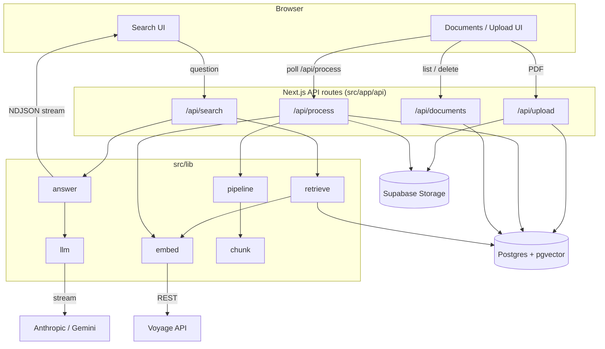

# The Orthodox Library

Ask a question and get an answer from the Orthodox Christian tradition — the
scriptures, the Fathers, the councils, the liturgies and the desert sayings of
**both the Eastern Orthodox and the Oriental Orthodox Churches** — with every
claim carrying an inline `[n]` citation back to the passage it came from, and a
plain refusal when the books do not cover the question.

The library is public domain end to end: 38 volumes of the Ante-Nicene and
Nicene & Post-Nicene Fathers, the Septuagint and the full Orthodox canon, the
Ethiopian Tewahedo books, the sayings of the desert fathers, the Eastern
liturgies, and the Byzantine service books. See [docs/CORPUS.md](docs/CORPUS.md)
for the complete list, the provenance of every text, and — just as importantly —
what is missing and why.

## What it does

Three ways to ask, because these are genuinely different questions:

- **Ask** — a direct question, answered from across the whole library.
  *"What do the Fathers teach about the resurrection of the body?"*
- **Compare sources** — what **each** book says on its own terms, grouped by
  tradition, with the disagreements left visible rather than smoothed over.
  *"Is there anyone besides Christ who rose from the dead?"*
- **For my situation** — someone describes something in their own life and gets
  what the Fathers, the sayings, the scriptures and the lives of the saints
  actually say to it. *"I keep falling into the same sin and I am losing hope."*

And underneath all three:

- **Two communions, honestly.** Every work is catalogued with the tradition that
  holds it. Everything before Chalcedon is marked as belonging to both, so
  filtering to one side never hides the shared Fathers. Where a source is
  received by one communion and not the other — the Seven Ecumenical Councils
  most of all — the answer is required to say so.
- **Citations a reader can check.** Not "page 412" of a file they do not have,
  but `Wisdom 3:1-12` and `NPNF2-13 — Demonstration VII. Of Penitents`.
  Each source is segmented by its own structure before chunking, so no passage
  ever straddles the reference that names it.
- **Refusal over invention.** If the retrieved passages do not answer the
  question, the model says so and cites nothing. On a corpus where being
  confidently wrong about which Church holds what is the worst possible failure,
  this constraint is the product.
- **Care in the counsel mode.** It is told not to diagnose, not to give medical
  advice, not to offer ascetic counsel as a substitute for treatment, and to
  point to emergency help first if someone describes danger to life.

## Building the library

```bash
npm run corpus:verify      # check every source resolves (downloads nothing)
npm run corpus:orthodox    # fetch the public-domain texts (~200MB, deliberately slow)
npm run corpus:inspect     # OCR quality distribution, for calibration
npm run ingest:orthodox    # segment, chunk, embed, store — resumable
```

Ingestion is **rate-limited and designed to be interrupted**. On a free Voyage
account (3 requests/minute, 10k tokens/minute) the full corpus — 101k chunks,
44M tokens — is roughly three days of embedding, so works are ingested in
priority order — scripture and the pastoral texts first — and every run resumes
at the first chunk the database does not have. Run `--hours 3` to work in
sessions, or raise `VOYAGE_RPM`/`VOYAGE_TPM` after upgrading the account.

## Architecture



Retrieval logic (`src/lib`) is shared by the web app and the CLI; the ingestion
pipeline (`extract → chunk → embed → insert`) lives in `src/lib/pipeline.ts` and
is used by both the CLI and the `/api/process` route, so it exists in one place.

## Stack

- Next.js 15 (App Router) + TypeScript + Tailwind
- Supabase Postgres with pgvector (+ Supabase Storage for uploaded PDFs)
- Voyage AI embeddings — `voyage-4`, output pinned to 1024 dims
- Generation behind a provider interface: Anthropic `claude-sonnet-5` **or**
  Google Gemini (`gemini-flash-latest`), selected by `GENERATION_PROVIDER`
- `unpdf` for PDF text extraction

## Setup

1. **Install:** `npm install` (Node 20+).
2. **Database:** create a Supabase project and run `schema.sql` in the SQL editor
   (creates the `documents` / `chunks` tables, the pgvector index, and the
   `match_chunks` / `keyword_chunks` search functions).
3. **Env:** copy `.env.example` to `.env.local` and fill in:
   - `SUPABASE_URL`, `SUPABASE_SERVICE_ROLE_KEY`
   - `VOYAGE_API_KEY`
   - `GENERATION_PROVIDER` = `anthropic` or `gemini`, plus the matching key
     (`ANTHROPIC_API_KEY` or `GEMINI_API_KEY`). Only the selected provider's key
     is required.
4. **Storage:** nothing to do — the private `documents` bucket is created
   automatically on the first browser upload.
5. **Ingest some PDFs** (either path):
   - CLI: `npm run ingest -- ./path/to/pdfs` (add `--dry-run` to preview,
     `--strip-repeated` to drop running headers/footers).
   - Browser: run the app and drag PDFs onto `/documents`.
6. **Run:** `npm run dev` → http://localhost:3000. Production build:
   `npm run build`.

Other scripts: `npm run query -- "<q>"` (retrieval only), `npm run ask -- "<q>"`
(retrieve + cited answer in the terminal), `npm run ask -- --refusals` (refusal
smoke check against the dev golden set).

## Evaluation

**→ [`docs/WRITEUP.md`](docs/WRITEUP.md) is the argument: what was measured, what
it found, and what it cannot tell you.** The short version:

- **91 human-reviewed questions**, 28% of candidates dropped, 17% deliberately
  unanswerable — the bucket that separates a retriever from a fabricator.
- **One of four LLM judges is validated.** `correctness` at Cohen's kappa 0.80
  (random sample) and 0.89 (stratified). The other three agree with me
  67&ndash;100% of the time on samples containing almost no negatives, which is
  agreement without evidence — and the writeup says so rather than printing four
  green numbers.
- **Three of four retrieval experiments did nothing**, and the one finding worth
  more than all of them came from the per-type breakdown: 4 of 6 questions
  retrieval got right were lost when the question was reworded.
- **Nothing shipped.** The config is unchanged, because the one arm with a real
  recall gain has never been measured on answer quality.
- **The holdout was audited, then spent once.** Composition-matched, it lands
  +5.8pp on recall and +3.7pp on correctness against dev — inside an interval 60
  points wide. It confirms the dev number; at n=10 it could not have done more.
- **The measurement was wrong three times** — a truncated labelling UI, a
  contaminated unanswerable bucket, and a rubric with no answer for refusals.
  All three are documented, because each one initially looked like a system
  failure.

The harness is built per [`docs/EVAL_HARNESS.md`](docs/EVAL_HARNESS.md). All ten
phases are complete: scaffolding, golden set, retrieval metrics, judge
calibration, runner and caching, statistics, [eleven experiment
arms](docs/EVAL_RESULTS.md), the regression gate, the `/evals` dashboard, and CI.

The judge calibration is in
[the writeup](docs/WRITEUP.md#3-how-the-judge-was-validated--and-why-only-one-of-four-survived),
reported per sampling design, because pooling a random sample with a stratified
one describes a population that never existed. Regenerate either half with
`npm run eval:calibrate -- --report-only --design random|stratified`.

Baseline, full pipeline on the 76-question dev split, 0 errors, $0
(`npm run eval:run -- --variant baseline`):

| Metric | @1 | @5 | @10 |
|---|---|---|---|
| recall | 20.9% | 48.6% | 52.8% |
| hit rate | — | — | 61.9% |
| nDCG | — | — | 42.9% |
| doc recall | — | — | 69.0% |

MRR 43.4%, median latency 1,190 ms. `correctness` 52.4% — the only judged
number with a validated judge behind it, and it tracks recall@10 almost exactly:
the system answers when retrieval finds the chunk and declines when it does not.
**24 of 63 answerable questions get a refusal.**

> **On reproducibility, precisely.** Retrieval is deterministic given the corpus
> and the cache, but two `baseline` runs on these 76 questions reported 51.2% and
> 52.8%. The difference is one question where hybrid retrieval lost one of its
> two sources and fused only the survivor. The runner records that as `degraded`
> and `eval:compare` prints it, which is why this is a footnote rather than an
> unexplained 1.6pp. The table above is the run with none.

> An earlier ad-hoc eval (35 questions over a 26-chunk corpus) reported
> recall@5 = 100%. Those numbers are deleted, not carried forward: they came from
> a corpus roughly 1% the size of the current one and were saturated — every
> setting scored 100%, so they could not distinguish anything and would be
> actively misleading beside the new harness. Recoverable from git history if
> ever needed.

### The golden set

91 human-reviewed questions over a 2,134-chunk / 90-document corpus, split into
two files that are **never** used interchangeably:

| File | Questions | Purpose |
|---|---|---|
| `eval/golden/questions.dev.jsonl` | 76 | Tune against this. The default everywhere. |
| `eval/golden/questions.holdout.jsonl` | 13 | Measured once, at the end. Requires `--holdout`. |

> **Dev was 77 until a 2026-07-27 audit of the unanswerable bucket.** 4 of its 15
> unanswerable questions turned out to be answerable from the corpus: each had
> been drafted as absent from *one* paper and phrased generically, so other
> documents answered them. Two were re-anchored to their intended paper, one was
> reclassified as a factoid, one was removed. Refusal accuracy went from an
> apparent 50% to a true 100%. See [`docs/EVAL_RESULTS.md`](docs/EVAL_RESULTS.md).

> **The holdout was audited the same way before being spent, and 2 of its 5
> unanswerable questions were contaminated too** — the flaw was predicted and
> then confirmed. `q-0095` asks for an accuracy the source paper prints in two
> different tables; `q-0097` asks a publication date that survives PDF
> extraction as `arXiv:2301.01269v1 [cs.CL] 3 Jan 2023`. Both dropped, taking
> the holdout from 15 to 13 and its unanswerable bucket to 3. The audit is
> retrieval-only and computes no metrics — `npm run eval:audit-unanswerable --
> --holdout` — so it validates the questions without spending the measurement.

The split is seeded (seed 42) and reproducible via `npm run eval:split`; the seed
and rule are written into both files' `#` headers so any number can be traced
back to the split that produced it.

**Split rule, and why it is not a uniform sample:**

- The holdout draws **only** from factoid (7), unanswerable (5), and paraphrase
  (3).
- **Multi-hop (n=7) and aggregation (n=8) stay entirely in dev.** Both are far
  too small to survive a split — a 20% share would put one or two questions on
  each side, where a single item moves the score by tens of points — and too
  small to meaningfully tune against in the first place.
- **Paraphrase families are atomic.** A paraphrase and its parent factoid never
  straddle the split. A paraphrase exists to test robustness to rewording *the
  same question*, so tuning on the parent would transfer straight to its holdout
  twin — the most direct leakage available. The splitter asserts this and fails
  loudly rather than writing a leaky split.

**Consequence, stated plainly: the holdout measures factoid / unanswerable /
paraphrase performance, not whole-system performance.** It says nothing about
multi-hop or aggregation, which are dev-only. Report it as such.

Every script and runner defaults to dev. Reading the holdout requires an explicit
`--holdout` flag and prints a warning that it is a one-time measurement — a
holdout re-run after every change is just a second dev set with a misleading
name.

### Comparing runs

```bash
npm run eval:compare -- <runA> <runB> [--local] [--regressions] [--metric recall@10]
```

Each argument is a run id or a variant name (which resolves to that variant's
most recent run that actually has results). Runs load from Supabase by default,
or from `eval/runs/*.jsonl` with `--local`.

The comparison is **paired**: both runs answered the same questions, so it joins
on question id and bootstraps the per-question *differences* rather than
comparing two means. Question difficulty is the dominant source of variance at
n=76 and both arms feel it identically, so differencing cancels it. Every row
carries a 95% confidence interval and a p-value; `--regressions` lists the
individual questions a change made worse, with their text, which is the actual
debugging workflow.

**What this golden set can and cannot detect.** At n=63 answerable questions and
a baseline recall@10 of 51.2%, the 95% interval on a single arm's mean is
±12.3pp, and the smallest difference two *independent* arms could resolve at 80%
power is about 25pp. Pairing shrinks that substantially — by a factor of √(1−ρ), and two
arms of the same pipeline correlate strongly — but the honest headline is that
**this set cannot distinguish variants that differ by a few points.** Any such
result is inconclusive, not negative. The tool prints these figures on every
comparison so the limitation travels with the numbers instead of being something
a reader has to know to ask about.

One consequence worth naming: cost and latency rows compare the runs *as
executed*, cache state and rate-limiter pacing included. A cold run against a
cached one shows a large, statistically significant latency difference while
retrieving byte-identical chunks. That is a true fact about the two runs and
says nothing about the variants.

## Deploying (Vercel)

Prerequisites: a Supabase project with `schema.sql` applied, and your API keys.
The app reads all secrets from environment variables — nothing is baked into the
build.

Using the Vercel CLI (no GitHub repo required):

```bash
npm i -g vercel && vercel login
vercel link                                  # create/link the project
# Add each secret (you'll be prompted for the value):
vercel env add SUPABASE_URL production
vercel env add SUPABASE_SERVICE_ROLE_KEY production
vercel env add VOYAGE_API_KEY production
vercel env add GENERATION_PROVIDER production   # anthropic | gemini
vercel env add GEMINI_API_KEY production        # or ANTHROPIC_API_KEY
vercel env add APP_PASSWORD production           # strongly recommended (see below)
vercel --prod                                    # build + deploy
```

Or via GitHub: create a repo, push, import it in the Vercel dashboard, set the
same variables under **Settings → Environment Variables**, and deploy.

- **Set `APP_PASSWORD`.** Without it the deployment is open to anyone with the
  URL, and uploads/searches cost embedding and LLM tokens. With it set, the whole
  app requires HTTP Basic auth (any username, that password).
- The private `documents` Storage bucket is created automatically on the first
  upload — no manual step.
- The Voyage free tier (3 embeddings/min) throttles ingestion and hybrid search;
  hybrid degrades to keyword-only when the limit is hit.

## Limitations

- **The golden set is small, and small in specific places.** 76 dev questions.
  At n≈76 a recall@10 of 0.6 carries a 95% CI of roughly ±0.11, so differences
  under ~5 points are not distinguishable and must be reported as null results,
  not wins. Worse per bucket: multi-hop is n=7 and aggregation n=8, where a
  single question moves the score by 12–14 points — neither supports a per-type
  conclusion, and Phase 6's per-type breakdown should say so rather than print a
  number that looks like evidence.
- **The holdout is 13 questions and covers three types.** It is enough to catch a
  gross overfit, not to estimate anything precisely: a 13-question score has a
  CI wide enough to swallow most plausible differences. Treat it as a sanity
  check on the dev number, not as an independent measurement. Its unanswerable
  bucket is 3 questions after the audit, which is too few for a refusal rate —
  report the count, not a percentage.
- **Voyage free tier is 3 embeddings/min.** Large ingests and vector/hybrid evals
  must be paced (`--delay`), and in the web app a query that hits the limit
  **degrades to keyword-only** rather than failing.
- **Upload size and processing model.** `/api/upload` buffers the whole file in
  the serverless function (capped at 15 MB, and subject to platform request-body
  limits). Processing is one document per `/api/process` call, client-triggered
  and polled — there is no cron, so if the tab closes mid-batch the remaining
  `pending` documents wait until something calls `/api/process` again. Claiming a
  pending row (select-then-update) is not atomic, so concurrent triggers could
  double-process; fine for single-user, not for scale.
- **No OCR.** Pages with too little extractable text are treated as scanned and
  skipped.
- **Retrieval is RRF-only.** Fixed ~800-token page-bounded chunks; no semantic
  chunking and no re-ranking stage.
- **Single-tenant.** The server uses the Supabase service-role key; RLS is enabled
  with no policies and there is no auth or per-user isolation.
- **Refusal is prompt-enforced, not guaranteed.** It's held to account by the
  refusal harness, but a model can still deviate.
- **The multi-hop bucket is intra-document only, and is 8% of the set, not 20%.**
  `docs/EVAL_HARNESS.md` originally specified multi-hop questions spanning two
  *different* documents, at 20% of the golden set. Measured on this corpus —
  90 topically unrelated arXiv NLP papers — cross-document multi-hop yielded
  **2 questions from 33 generation attempts, and 0 of 33 end-to-end after human
  review**; same-document pairs yielded 12 from 51, of which 7 survived. The
  targets were retargeted to measurement: multi-hop 20% → **8%**, factoid
  35% → **47%** to absorb the difference.

  This is a property of *corpus construction*, not of the generator. Pairs are
  ranked by IDF-weighted entity salience and the model declines them correctly:
  two papers that both mention `BERT` or `ICASSP` share a topic, not a joint
  fact. An arbitrary sample of unrelated papers contains almost no cross-document
  joint facts; a corpus of *related* documents would behave differently.

  All 7 accepted multi-hop questions therefore pair two sections of one paper
  (≥5 chunks apart, typically a method and its results). These are genuine
  two-chunk questions, but a same-document question can often be answered from
  one well-chosen chunk, so the bucket tests multi-chunk assembly **less severely
  than the original design intended**. `multihopKind` is retained on every
  question and reported, but no cross-doc share is enforced — a target the corpus
  cannot supply at any attempt count is a permanently red check, not a standard.
  **At n=7 this bucket cannot support a per-type conclusion**; report it
  descriptively with the count attached.
- **Aggregation questions are generated deterministically, not by an LLM.** Their
  ground truth is the entity document-frequency index, so "how many papers
  mention X" is exact and reproducible — but it measures retrieval against the
  *extractor's* notion of which chunks mention X, not a human's. Asking a model
  instead returned null 4 times in 10 and produced unverified answers for the
  rest.
- **Golden set review: 126 candidates, 92 accepted, 34 dropped (27%).** Slightly
  under the 30–40% drop rate `docs/EVAL_HARNESS.md` expects. Per bucket:
  factoid 43/49 (88%), unanswerable 20/28 (71%), paraphrase 14/20 (70%),
  multi-hop 7/14 (50%), aggregation 8/15 (53%).

  **The first review pass dropped all 28 unanswerable questions — a tooling bug,
  not a judgment.** The review UI displayed every candidate beside its source
  chunk, which framed the reviewer's implicit question as *"is this answerable
  here?"* — a test an unanswerable question fails by definition. The entire
  highest-signal bucket was rejected in one pass, and the run still looked
  successful: 70 questions accepted, no error, no warning. The UI now renders
  unanswerable candidates differently — no source chunk, an explicit banner, and
  a **live retrieval of the top 3 corpus matches** shown as evidence *against*
  the candidate, so "nothing in the corpus answers this" is checked rather than
  assumed. Re-reviewed, the same 28 questions were accepted at 71%.

  This is worth reporting rather than quietly fixing: eval tooling can silently
  destroy the most valuable part of a test set, and the failure is invisible in
  every summary statistic. The bucket that measures whether the system refuses or
  hallucinates was the one the tooling was worst at presenting.
