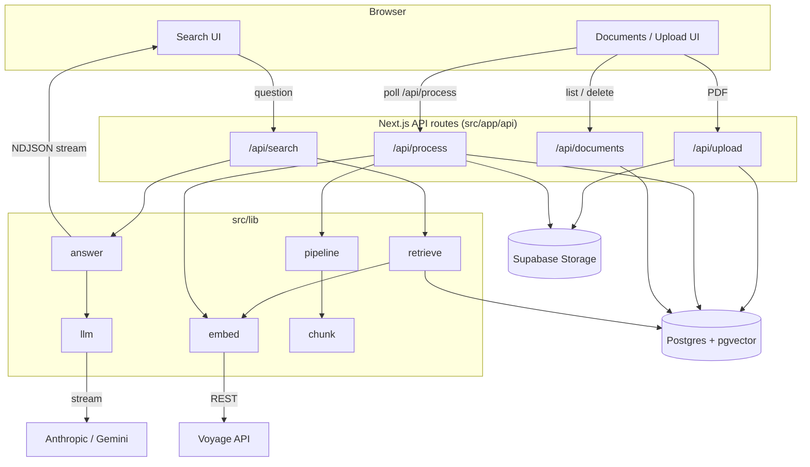

# DocSearch

Ask questions about a corpus of PDFs and get answers that are **grounded and
cited** — every factual claim carries an inline `[n]` citation back to the source
chunk, and the system refuses plainly when the documents don't cover the
question instead of guessing.

Retrieval is **hybrid**: vector similarity (Voyage embeddings over pgvector) and
Postgres full-text keyword search, fused with Reciprocal Rank Fusion. Generation
is provider-agnostic (Anthropic or Google Gemini) and streamed to the browser
with the citation targets rendered before the answer text.

## What it does

- **Ingest** PDFs — via the CLI (`npm run ingest`) or drag-and-drop in the
  browser. Each PDF is extracted per page, chunked (~800 tokens, page-bounded),
  embedded with `voyage-4` (1024-dim), and stored in Postgres.
- **Search** — a question runs hybrid retrieval (vector + keyword + RRF); the top
  chunks are numbered and fed to the model, which streams a cited answer. Inline
  `[n]` chips open a panel with the source chunk's full text, title, and page.
- **Refuse** — if the retrieved chunks don't answer the question, the model
  replies "…not covered by these documents" with no citation, rather than
  answering from general knowledge.
- **Manage** — list documents with page/chunk counts and status, delete them
  (chunks cascade), and watch uploads progress from `pending` → `complete`.

## Architecture



Retrieval logic (`src/lib`) is shared by the web app and the CLI; the ingestion
pipeline (`extract → chunk → embed → insert`) lives in `src/lib/pipeline.ts` and
is used by both the CLI and the `/api/process` route, so it exists in one place.

## Stack

- Next.js 15 (App Router) + TypeScript + Tailwind
- Supabase Postgres with pgvector (+ Supabase Storage for uploaded PDFs)
- Voyage AI embeddings — `voyage-4`, output pinned to 1024 dims
- Generation behind a provider interface: Anthropic `claude-sonnet-5` **or**
  Google Gemini (`gemini-flash-latest`), selected by `GENERATION_PROVIDER`
- `unpdf` for PDF text extraction

## Setup

1. **Install:** `npm install` (Node 20+).
2. **Database:** create a Supabase project and run `schema.sql` in the SQL editor
   (creates the `documents` / `chunks` tables, the pgvector index, and the
   `match_chunks` / `keyword_chunks` search functions).
3. **Env:** copy `.env.example` to `.env.local` and fill in:
   - `SUPABASE_URL`, `SUPABASE_SERVICE_ROLE_KEY`
   - `VOYAGE_API_KEY`
   - `GENERATION_PROVIDER` = `anthropic` or `gemini`, plus the matching key
     (`ANTHROPIC_API_KEY` or `GEMINI_API_KEY`). Only the selected provider's key
     is required.
4. **Storage:** nothing to do — the private `documents` bucket is created
   automatically on the first browser upload.
5. **Ingest some PDFs** (either path):
   - CLI: `npm run ingest -- ./path/to/pdfs` (add `--dry-run` to preview,
     `--strip-repeated` to drop running headers/footers).
   - Browser: run the app and drag PDFs onto `/documents`.
6. **Run:** `npm run dev` → http://localhost:3000. Production build:
   `npm run build`.

Other scripts: `npm run query -- "<q>"` (retrieval only), `npm run ask -- "<q>"`
(retrieve + cited answer in the terminal), `npm run ask -- --refusals` (refusal
check), `npm run eval -- --mode hybrid` (retrieval metrics).

## Evaluation

Measured on a 35-question gold set (`evals/questions.jsonl`), hybrid mode,
top-10. Full write-up in [`evals/EXPERIMENTS.md`](evals/EXPERIMENTS.md); metric
definitions in [`evals/README.md`](evals/README.md).

| Metric | overall | easy | medium | hard |
|---|---|---|---|---|
| recall@1 | 88.6% | 100% | 94.4% | 85.7% |
| recall@5 | 100% | 100% | 100% | 100% |
| recall@10 | 100% | 100% | 100% | 100% |
| MRR | 0.930 | 1.000 | 0.900 | 0.905 |

- **RRF `k` experiment (20 / 60 / 120):** no measurable effect — recall@5 and MRR
  are identical across all three and no question changed rank. recall@5 is
  already saturated at 100%, so the gold set can't distinguish the settings. See
  `evals/EXPERIMENTS.md`.
- **Refusal:** all five unanswerable questions refuse with no citation markers
  (`npm run ask -- --refusals`).

## Deploying (Vercel)

Prerequisites: a Supabase project with `schema.sql` applied, and your API keys.
The app reads all secrets from environment variables — nothing is baked into the
build.

Using the Vercel CLI (no GitHub repo required):

```bash
npm i -g vercel && vercel login
vercel link                                  # create/link the project
# Add each secret (you'll be prompted for the value):
vercel env add SUPABASE_URL production
vercel env add SUPABASE_SERVICE_ROLE_KEY production
vercel env add VOYAGE_API_KEY production
vercel env add GENERATION_PROVIDER production   # anthropic | gemini
vercel env add GEMINI_API_KEY production        # or ANTHROPIC_API_KEY
vercel env add APP_PASSWORD production           # strongly recommended (see below)
vercel --prod                                    # build + deploy
```

Or via GitHub: create a repo, push, import it in the Vercel dashboard, set the
same variables under **Settings → Environment Variables**, and deploy.

- **Set `APP_PASSWORD`.** Without it the deployment is open to anyone with the
  URL, and uploads/searches cost embedding and LLM tokens. With it set, the whole
  app requires HTTP Basic auth (any username, that password).
- The private `documents` Storage bucket is created automatically on the first
  upload — no manual step.
- The Voyage free tier (3 embeddings/min) throttles ingestion and hybrid search;
  hybrid degrades to keyword-only when the limit is hit.

## Limitations

- **Small, saturated eval set.** 35 answerable questions with recall@5 already at
  100% — good enough to catch regressions and hallucinated citations, but too
  easy to distinguish fine retrieval changes (hence the RRF-`k` null result).
- **Voyage free tier is 3 embeddings/min.** Large ingests and vector/hybrid evals
  must be paced (`--delay`), and in the web app a query that hits the limit
  **degrades to keyword-only** rather than failing.
- **Upload size and processing model.** `/api/upload` buffers the whole file in
  the serverless function (capped at 15 MB, and subject to platform request-body
  limits). Processing is one document per `/api/process` call, client-triggered
  and polled — there is no cron, so if the tab closes mid-batch the remaining
  `pending` documents wait until something calls `/api/process` again. Claiming a
  pending row (select-then-update) is not atomic, so concurrent triggers could
  double-process; fine for single-user, not for scale.
- **No OCR.** Pages with too little extractable text are treated as scanned and
  skipped.
- **Retrieval is RRF-only.** Fixed ~800-token page-bounded chunks; no semantic
  chunking and no re-ranking stage.
- **Single-tenant.** The server uses the Supabase service-role key; RLS is enabled
  with no policies and there is no auth or per-user isolation.
- **Refusal is prompt-enforced, not guaranteed.** It's held to account by the
  refusal harness, but a model can still deviate.
